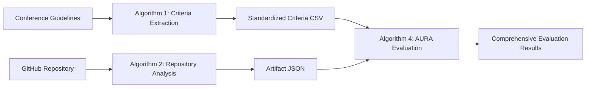

# Algorithm 1: Automated Evaluation Criteria Extraction for Conference Guidelines

## 🎯 Research Problem & Context

### Core Research Questions

Algorithm 1 addresses several critical research questions in automated artifact evaluation:

**RQ1: Criteria Standardization**
- *How can we automatically extract and standardize evaluation criteria from diverse conference guidelines?*
- *Challenge*: Different conferences (ICSE, FSE, SIGMOD, etc.) have varying artifact evaluation requirements written in natural language

**RQ2: Semantic Understanding**
- *How can we build semantic relationships between evaluation criteria across different conferences?*
- *Challenge*: Similar concepts are expressed differently across venues (e.g., "reproducibility" vs "replicability")

**RQ3: Confidence Assessment**
- *How can we provide confidence scores for automatically extracted criteria?*
- *Challenge*: Automated extraction may introduce noise or miss important nuances

**RQ4: Hierarchical Organization**
- *How can we organize extracted criteria into hierarchical structures for downstream processing?*
- *Challenge*: Flat keyword lists lack the semantic organization needed for sophisticated evaluation systems

## 🧠 Technical Methodology

### Overview
Algorithm 1 uses advanced Natural Language Processing (NLP) techniques to transform unstructured conference guideline texts into structured, standardized evaluation criteria. It combines multiple approaches for robust extraction:

```
Conference Guidelines (MD files) → NLP Processing → Structured Criteria (CSV/JSON)
                ↓
    [TF-IDF + Semantic Similarity + KeyBERT + Hierarchical Organization]
                ↓
    6 Standardized Dimensions + Keywords + Weights + Confidence Scores
```

### Core NLP Techniques

#### 1. **Multi-layered Keyword Extraction**
- **TF-IDF Vectorization**: Identifies statistically important terms across conference guidelines
- **KeyBERT**: Extracts semantically relevant keywords using BERT embeddings
- **Sentence Transformers**: Creates contextual embeddings for semantic similarity
- **Hierarchical Categories**: Organizes keywords into core, semantic, contextual, and domain-specific groups

#### 2. **Semantic Relationship Mapping**
- **Embedding-based Similarity**: Uses `all-MiniLM-L6-v2` model for semantic understanding
- **DBSCAN Clustering**: Groups semantically similar keywords across dimensions
- **Cross-dimension Analysis**: Identifies relationships between different evaluation aspects
- **Contradiction Detection**: Finds potentially conflicting requirements

#### 3. **Confidence Scoring System**
- **Source Coverage**: How many documents contribute to each dimension
- **Keyword Consensus**: Agreement between different extraction methods
- **Semantic Coherence**: How well keywords cluster together semantically
- **Frequency Stability**: Distribution consistency of keyword frequencies
- **Cross-validation Score**: Consistency across extraction approaches

## 🏗️ System Architecture

### Input Processing Pipeline

```python
# 1. Document Loading & Preprocessing
Conference Guidelines (.md) → Text Cleaning → Tokenization → Stopword Removal

# 2. Feature Extraction
Cleaned Text → TF-IDF Matrix → Term Extraction → Semantic Embeddings

# 3. Hierarchical Keyword Generation
Dimension Examples → KeyBERT → Multi-category Seeds → Semantic Expansion

# 4. Criteria Extraction
Keywords + TF-IDF Scores → Weighted Scoring → Normalization → Confidence Assessment
```

### Core Components

#### `EnhancedAlgorithm1` Class
- **Initialization**: Loads sentence transformer model (`all-MiniLM-L6-v2`) and KeyBERT
- **Configuration**: Manages similarity thresholds, expansion parameters, confidence settings
- **Processing Pipeline**: Orchestrates the entire extraction workflow

#### Key Methods
- `generate_hierarchical_seed_keywords()`: Creates multi-level keyword hierarchies
- `extract_evaluation_criteria()`: Main extraction logic with TF-IDF and semantic analysis  
- `build_semantic_relationship_map()`: Maps relationships between extracted terms
- `_calculate_criteria_confidence()`: Computes multi-metric confidence scores
- `generate_enhanced_outputs()`: Creates multiple output formats for different use cases

## 📊 Evaluation Dimensions

Algorithm 1 extracts and standardizes criteria across **6 core dimensions** identified from conference analysis:

| Dimension | Weight | Description | Example Keywords |
|-----------|--------|-------------|------------------|
| **Reproducibility** | ~27% | Ability to reproduce paper results | reproduce, replication, replicate, reproducible |
| **Documentation** | ~15% | Quality of setup and usage instructions | readme, documentation, guide, manual, tutorial |
| **Accessibility** | ~17% | Public availability and licensing | public, accessible, available, open, free |
| **Usability** | ~21% | Ease of installation and use | install, setup, use, demo, interface |
| **Experimental** | ~16% | Experimental setup and validation | experiment, evaluation, benchmark, test, analysis |
| **Functionality** | ~15% | Correctness and verification | function, test, verify, validate, correct |

*Weights are dynamically calculated based on TF-IDF scores across input conference guidelines*

## 🔄 Integration with AURA Framework

Algorithm 1 is the **first stage** in the three-algorithm AURA pipeline:



### Downstream Integration
- **Algorithm 4**: Uses extracted criteria for keyword-based artifact evaluation
- **LLM Agents**: Leverage hierarchical keywords for grounded evaluation
- **Research Analysis**: Enables cross-conference comparison studies

## 📁 Input/Output Formats

### Input Requirements
```
data/conference_guideline_texts/processed/
├── 13_icse_2025.md
├── 9_fse_2024.md
├── 19_mobicom_2024.md
└── ... (additional conference guidelines)
```

### Output Artifacts

#### 1. **Primary CSV Output** (`algorithm_1_artifact_evaluation_criteria.csv`)
```csv
dimension,keywords,raw_score,normalized_weight
reproducibility,"reproduce,replication,replicate,reproducible",15.42,0.273
documentation,"readme,documentation,guide,manual",8.64,0.154
```

#### 2. **Enhanced CSV** (`enhanced_algorithm_1_criteria_YYYYMMDD_HHMMSS.csv`)
- Includes hierarchical structure, category scores, keyword frequencies
- Contains confidence metrics and source document information

#### 3. **AURA Integration Format** (`aura_integration_data_YYYYMMDD_HHMMSS.json`)
```json
{
  "structured_criteria": [...],
  "grounding_evidence": {...},
  "confidence_weights": {...},
  "hierarchical_keywords": {...},
  "severity_weights": {...}
}
```

#### 4. **Research Analysis Format** (`research_analysis_YYYYMMDD_HHMMSS.json`)
- Conference comparison metrics
- Trend analysis across venues
- Methodology reporting

#### 5. **Human Review Format** (`human_review_data_YYYYMMDD_HHMMSS.json`)
- Keyword validation sheets
- Quality assessment reports
- Improvement recommendations

#### 6. **ML Features Format** (`ml_features_YYYYMMDD_HHMMSS.json`)
- Feature vectors for machine learning
- Training data preparation
- Embeddings for similarity analysis

## 🚀 Usage Instructions

### Basic Execution

```bash
# Navigate to algorithm directory
cd scripts/algorithm_1

# Run the enhanced algorithm
python enhanced_algorithm_1.py

# Or run the improved version (simpler)
python improved_algorithm_1.py
```

### Programmatic Usage

```python
from enhanced_algorithm_1 import EnhancedAlgorithm1

# Initialize algorithm
algo = EnhancedAlgorithm1(model_name='all-MiniLM-L6-v2')

# Define input/output paths
input_dir = "../../data/conference_guideline_texts/processed"
output_dir = "../../algo_outputs/algorithm_1_output"

# Run extraction
saved_files = algo.run_enhanced_extraction(input_dir, output_dir)

# Access results
print(f"Generated {len(saved_files)} output files:")
for file_type, path in saved_files.items():
    print(f"  - {file_type}: {path}")
```

### Configuration Options

```python
# Customize algorithm parameters
algo.config = {
    'semantic_similarity_threshold': 0.7,  # Similarity threshold for relationships
    'keyword_expansion_top_n': 8,          # Number of similar terms to expand
    'confidence_threshold': 0.6,           # Minimum confidence for reliability
    'min_keyword_frequency': 2,            # Minimum frequency for inclusion
    'max_keywords_per_dimension': 50,      # Maximum keywords per dimension
    'severity_weight_decay': 0.8           # Weight decay for severity levels
}
```

## 📈 Quality Metrics & Validation

### Confidence Scoring Components

1. **Source Coverage** (20% weight)
   - Measures how many conference documents contribute to each dimension
   - Higher coverage = more reliable extraction

2. **Keyword Consensus** (30% weight)
   - Agreement between different keyword extraction methods
   - Higher consensus = more robust keywords

3. **Semantic Coherence** (20% weight)
   - How well keywords cluster together semantically
   - Higher coherence = better conceptual consistency

4. **Frequency Stability** (20% weight)
   - Distribution consistency of keyword frequencies
   - Higher stability = more reliable scoring

5. **Cross-validation Score** (10% weight)
   - Consistency across different extraction approaches
   - Higher consistency = more methodological reliability

### Reliability Flags
- **High Confidence** (≥0.8): Reliable for direct use
- **Medium Confidence** (0.6-0.8): Suitable with human review
- **Low Confidence** (<0.6): Requires manual validation

## 🔧 Technical Requirements

### Dependencies
```bash
pip install pandas numpy scikit-learn nltk
pip install sentence-transformers keybert
pip install networkx torch
```

### NLTK Data
```python
import nltk
nltk.download('punkt')
nltk.download('stopwords') 
nltk.download('wordnet')
nltk.download('averaged_perceptron_tagger')
```

### Hardware Requirements
- **Memory**: 4GB+ RAM (for sentence transformer models)
- **Storage**: 2GB+ for model downloads
- **CPU**: Multi-core recommended for faster processing

## 🧪 Testing & Validation

### Unit Tests
```bash
# Run basic functionality tests
python test.py
```

### Validation Datasets
- 26+ conference guidelines from ACM and IEEE venues
- Covers domains: Software Engineering, Systems, AI/ML, HCI
- Includes both artifact evaluation and general submission guidelines

### Expected Outputs
- **Processing Time**: 2-5 minutes for 26 conference files
- **Keywords Extracted**: 150-300 unique keywords across 6 dimensions
- **Average Confidence**: 0.7-0.85 for well-documented conferences

## 📊 Research Contributions

### Methodological Innovations

1. **Hierarchical Keyword Extraction**
   - Novel multi-category approach (core, semantic, contextual, domain)
   - Enables fine-grained control over keyword selection and weighting

2. **Cross-Conference Standardization**
   - First automated approach to standardize diverse conference criteria
   - Enables systematic comparison across venues

3. **Confidence-Aware Extraction**
   - Multi-metric confidence scoring system
   - Provides reliability estimates for automated extractions

4. **Semantic Relationship Mapping**
   - Graph-based analysis of keyword relationships
   - Identifies contradictions and cross-dimension connections

### Research Impact

- **Artifact Evaluation**: Enables automated, consistent artifact assessment
- **Conference Analysis**: Facilitates comparative studies of evaluation practices
- **Research Infrastructure**: Provides foundation for scalable evaluation systems
- **Open Science**: Promotes standardized, transparent evaluation criteria

## 🔮 Future Enhancements

### Planned Improvements
- [ ] Support for multi-language conference guidelines
- [ ] Integration with Large Language Models for enhanced understanding
- [ ] Real-time updating as new conferences publish guidelines  
- [ ] Interactive visualization of semantic relationships
- [ ] Machine learning models for criteria prediction

### Research Directions
- [ ] Temporal analysis of evolving evaluation practices
- [ ] Domain-specific criteria extraction (e.g., security, performance)
- [ ] Automated guideline generation for new conferences
- [ ] Integration with submission and review systems

## 📚 Related Work & Citations

### Key References
- ACM Artifact Review and Badging Guidelines
- SIGPLAN Empirical Evaluation Guidelines  
- Software Systems Conferences Artifacts Guidelines
- Reproducibility Studies in Computer Science

### Publications
If you use this algorithm in your research, please cite:

```bibtex
@inproceedings{aura_algorithm1_2025,
  title={Automated Extraction of Evaluation Criteria from Conference Guidelines using Hierarchical NLP},
  author={[Your Name]},
  booktitle={Proceedings of ICSE 2025},
  year={2025}
}
```

## 🐛 Troubleshooting

### Common Issues

**Issue**: `ModuleNotFoundError: No module named 'sentence_transformers'`
```bash
pip install sentence-transformers
```

**Issue**: Low confidence scores across all dimensions
- Check input file quality and format
- Ensure conference guidelines contain artifact evaluation sections
- Verify preprocessing isn't removing too much content

**Issue**: Empty or minimal keyword extraction  
- Increase `min_keyword_frequency` threshold
- Check TF-IDF matrix dimensions
- Verify semantic similarity thresholds

### Debugging Tools
```python
# Enable debug logging
import logging
logging.getLogger().setLevel(logging.DEBUG)

# Inspect intermediate results
algo.config['debug_mode'] = True
```

## 👥 Contributing

### Development Setup
1. Fork the repository
2. Create feature branch (`git checkout -b feature/new-extraction-method`)
3. Make changes and add tests
4. Submit pull request with detailed description

### Adding New Conference Guidelines
1. Place markdown files in `data/conference_guideline_texts/processed/`
2. Follow naming convention: `{id}_{conference}_{year}.md`
3. Run algorithm to verify extraction quality
4. Update test cases if needed

---

*This README covers Algorithm 1 of the AURA framework. For the complete system documentation, see the main AURA repository README.*
